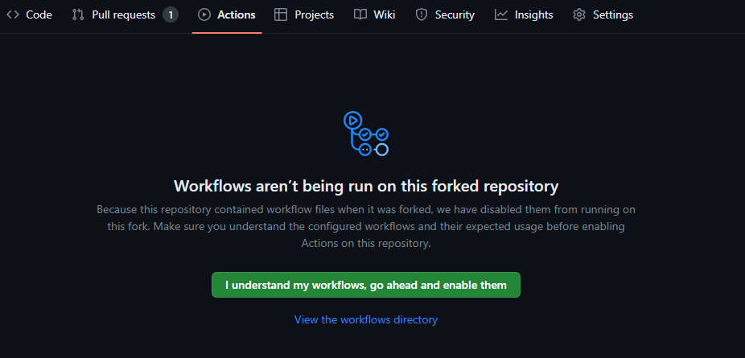

# Troubleshooting

## Example workflow doesn't start

Make sure you have enabled actions in your repo.
GitHub disables workflows in repos that were forked.

Go to your repo GitHub page, selelect `Actions` tab and click `I understand my workflows, go ahead and enable them if necessary`.
